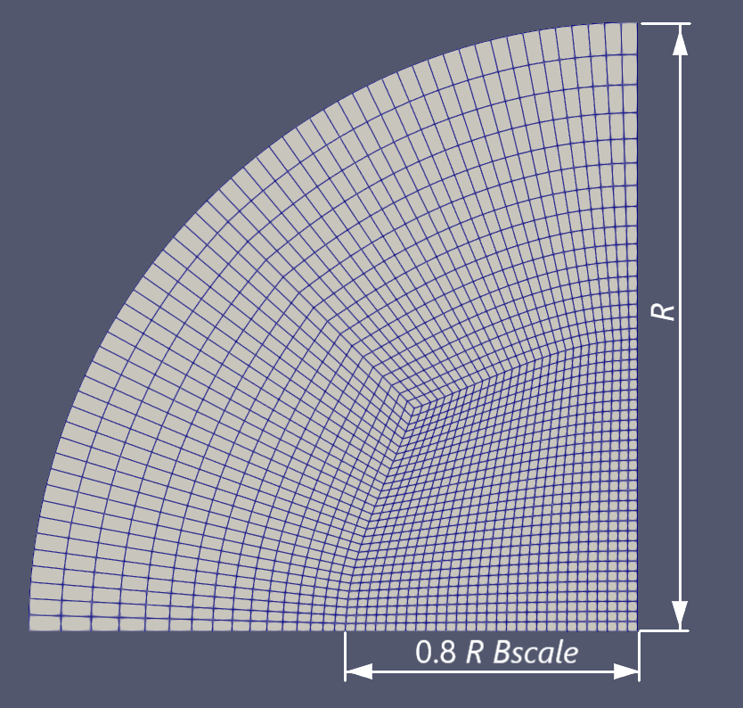
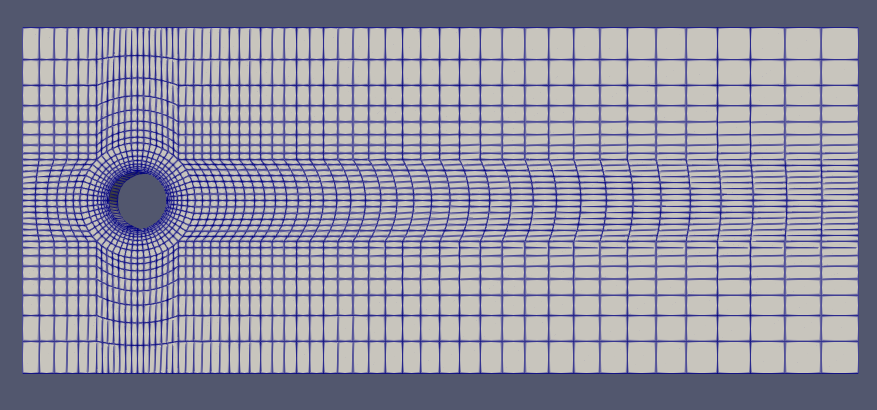
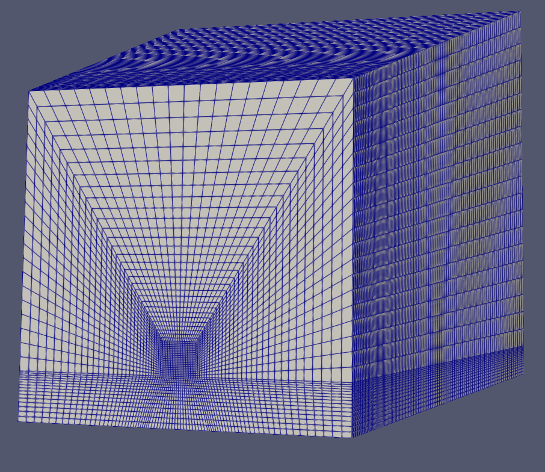
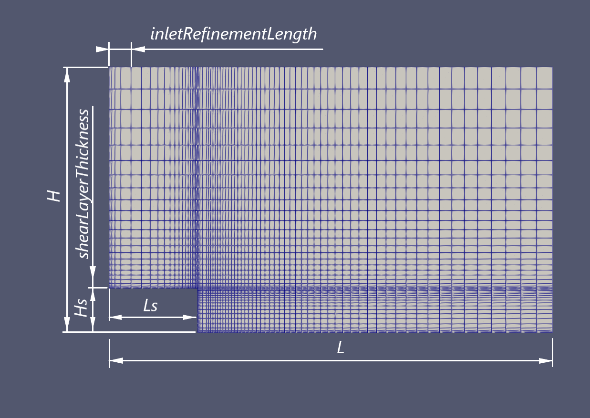

Mesh files description
| Case | Governing parameters  | patches | Notes |
|:---|:---|:---|:---|
| _frustumMeshDict_ | _R_ &mdash; pipe inlet radius   _L_ &mdash; domain length   _expRatWall_radial_ &mdash; cell grading in radial direction   _expRatWall_axial_ &mdash; cell grading donstream   _Bscale_ &mdash; regulates central refinement area size   _expansion_ &mdash; domain expansion (outlet to inlet radii ratio)   _Nradii_  &mdash; cell per radius| _inlet_   _outlet_   _wall_   _symmetryVer_   _symmetryHor_ |A quater of optionally expanded pipe   Mirror by your own to obtain full-cirle geometry |
| _flowAroundCylinderMeshDict_ | _r_ &mdash; cylinder radius   _CPD_ &mdash; cells per diameter   _rOuter_ &mdash; radial cells zone radius   _xmin_ &mdash; inlet coordinate, <0   _xmax_ &mdash; outlet coordinate, >0   _ymax_ &mdash; cylinder to top/bottom distance   _radialGrading_ &mdash; mesh grading to provide near-cylinder boundary layer   _downstreamGrading_ &mdash; cell expansion behind the cylinder   _upstreamGrading_ &mdash; cell expansion before the cylinder    verticalGrading &mdash; cell expansion up/down from the cylinder | _inlet_   _outlet_   _up_   _down_   _cylinder_   _frontAndBack_| 2D geometry in _xy_ plane (_z_=0)   cylinder center has position (0,0)  |
| _wallJetMeshDict_ | _D_ &mdash; diameter (used as a reference scale)   _L_ &mdash; domain length   _H_ &mdash;domain height    _w50_  &mdash; domain half-breadth   _zc_ &mdash; jet center hight over bottom   _f50_ &mdash; refinement area half-width   _ND_ &mdash; cells per diameter   _yb_ &mdash; regulates block under the refinement inclination   _domainExpansion_ &mdash; domain outlet-to-inlet scaling (hight and breadth)   _refinementExpansion_ &mdash; scaling of the refinement region (independently)   _gradingDownstream_ &mdash; cell _grading downstream_   cell grading downstream  _gradingFloor_ &mdash; cell grading tomards bottom   _gradingOuter_ &mdash; cell grading towards top/sides | _inlet_   _outlet_   _ceil_   _floor_   _side_ |Square equidistant refinement area near the center (0,0,_yc_) with 2 _f50_ size and expanding mesh around  Downstream expansion of both area and refinement is supported   _domainExpansion_ and _refinementExpansion_ can be set independently |
|_backwardFacingStepMeshDict_| _Hs_  &mdash; step height   _Ls_ &mdash; step length   _H_ &mdash; domain height   _L_ &mdash; domain length   _shearLayerThickness_ &mdash;  shear layer thickness   _inletRefinementLength_ &mdash; inlet heavily graded area length   _Nsh_ &mdash; cells per shear layer   _shearGrading_ &mdash; cell grading near walls (to resolve shear layer)   _topGrading_ &mdash; cell grading topwards   _inletGrading_ &mdash; cell grading in the inlet (smaller cell to inlet for shear profile formation)   _downstreamGrading_ &mdash; cell grading downstream|_inlet_   _outlet_   _to_   _bottom_   _bottomOverStep_   _verticalStepWall_   _sides_||
